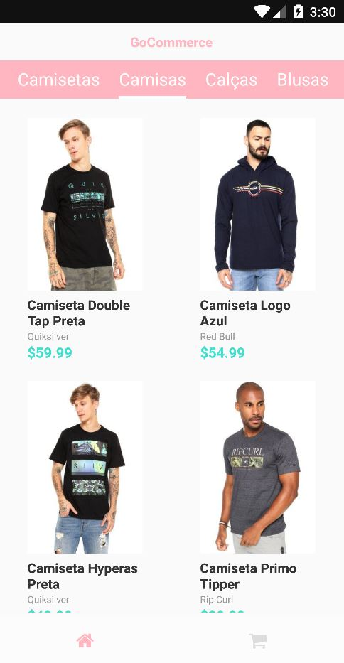
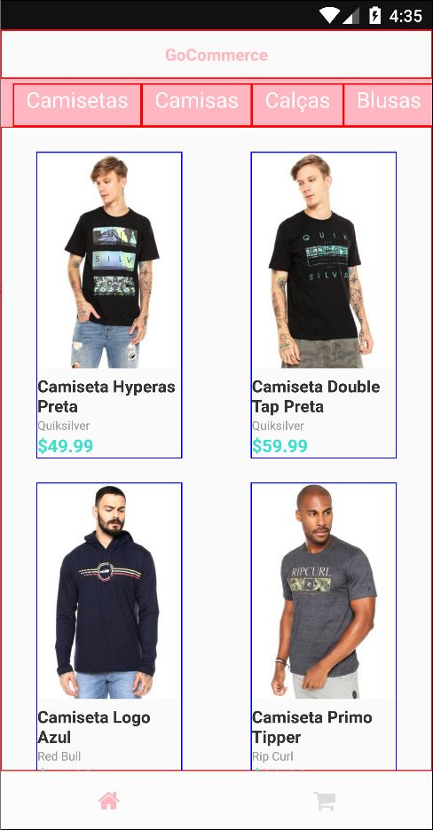

# e-Commerce simple app (React Native, Redux and Saga)

**Current state**

**First look**

## Installing

**Yarn package manager:** you can start by installing yarn at https://yarnpkg.com/en/docs/install

Run **yarn** command into the project's tree to install all dependencies

Run **yarn add global json-server**

Open another console/terminal tab and run **json-server server.json -p 3001 -w -d 500** to serve locally the mapped songs.

Run **yarn start**

**P.S.**

This project uses **reactotron** when dev env so that we can take a look at what's going on into the app (https://github.com/infinitered/reactotron)
